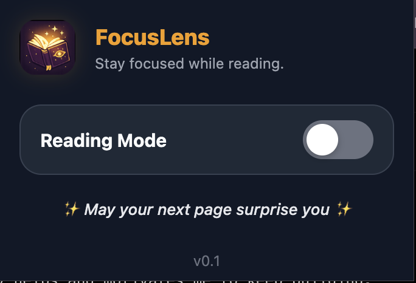
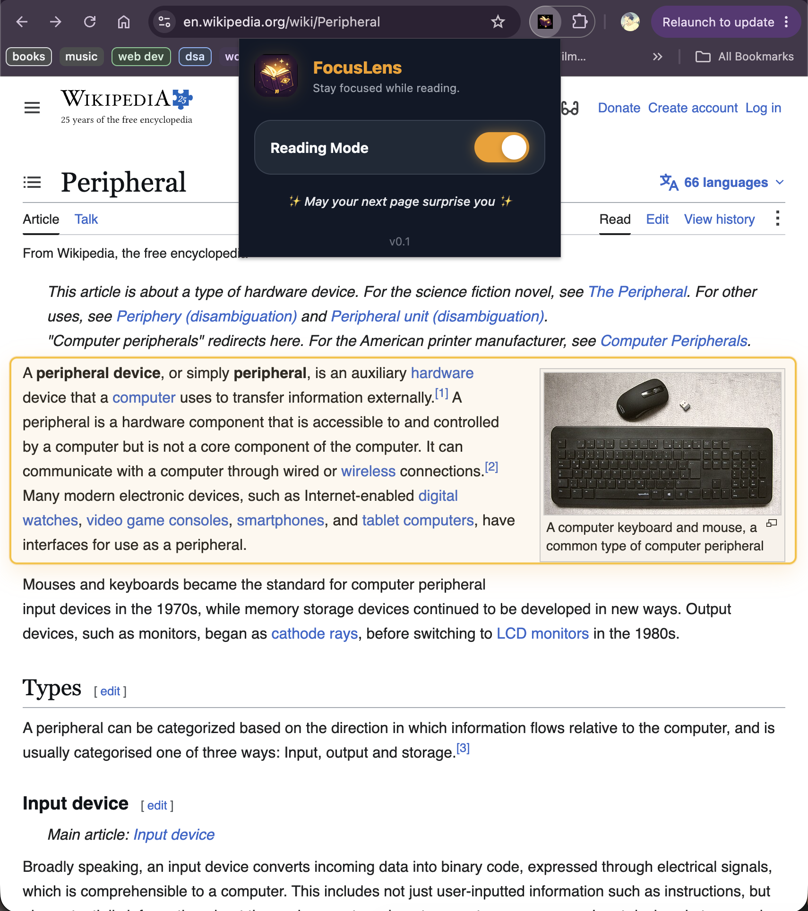
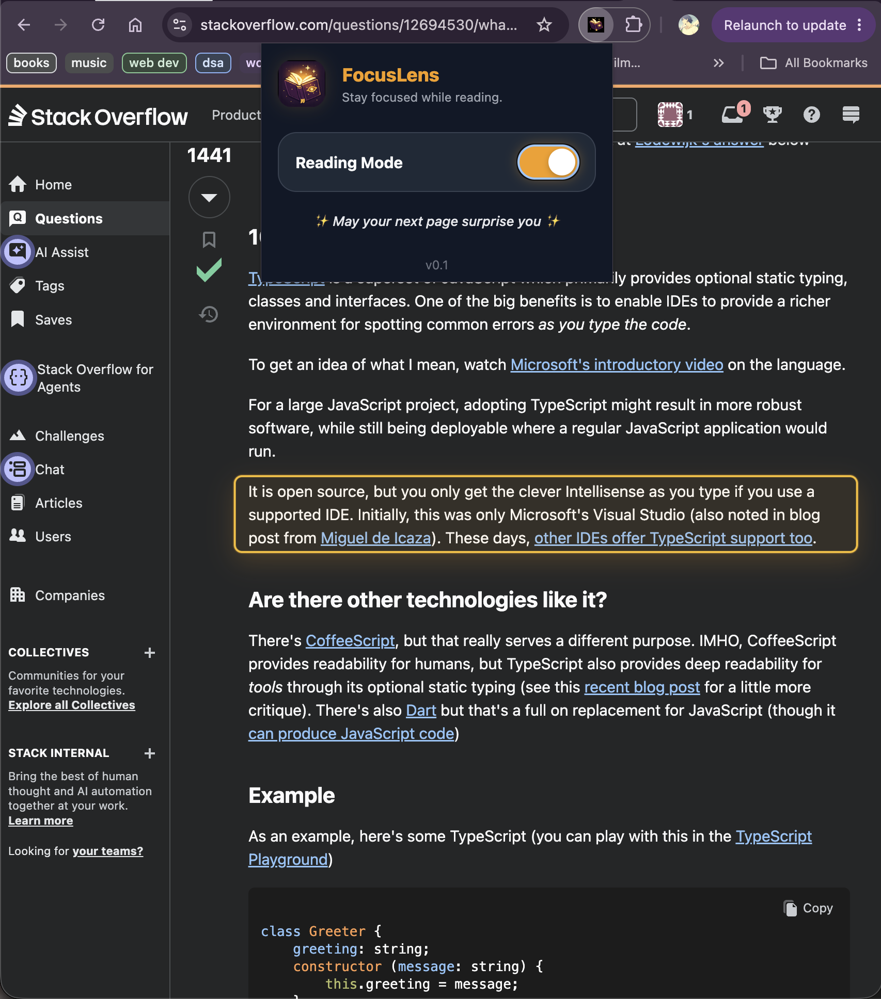

# 📖 FocusLens

> **Stay focused. One paragraph at a time.** ✨

FocusLens is a beautifully designed Chrome Extension that transforms online reading into a calm, distraction-free experience.

Instead of losing your place in long walls of text, FocusLens intelligently highlights the paragraph you're currently reading with smooth animations and an elegant interface, making reading feel effortless.

---

## 📸 Preview

### Popup Interface

> Replace this with a screenshot of your popup.



---

### Reading Mode

> Replace this with a screenshot showing the highlighted paragraph on any webpage.



---

### Dark Mode

> Replace this with a screenshot showing FocusLens working on a dark themed website.



---

## 🎥 Demo

> Replace this section with a GIF showing:
>
> - Opening the popup
> - Turning Reading Mode ON
> - Scrolling through a webpage
> - The highlight smoothly moving between paragraphs

Example:

```md

```

---

# ✨ Features

- 📖 Intelligent paragraph detection
- ✨ Smooth highlight animations
- 🎯 Helps maintain reading focus
- 🌙 Automatic Dark Mode support
- 💾 Remembers your preference using Chrome Storage
- ⚡ Lightweight and fast
- 🎨 Beautiful magical UI

---

# 🛠 Tech Stack

- **TypeScript**
- **HTML5**
- **CSS3**
- **Chrome Extension Manifest V3**
- **Chrome Storage API**

---

# 📂 Project Structure

```
FocusLens
│
├── assets/
│   ├── icons/
│   ├── screenshots/
│   └── demo.gif
│
├── popup.html
├── popup.css
├── popup.js
│
├── content.js
├── background.js
│
├── manifest.json
│
└── README.md
```

---

# ⚙ Installation

Clone the repository

```bash
git clone https://github.com/YOUR_USERNAME/FocusLens.git
```

Open Chrome Extensions

```
chrome://extensions
```

Enable

```
Developer Mode
```

Click

```
Load unpacked
```

Select the FocusLens project folder.

Done! 🎉

---

# 🚀 How It Works

1. Click the FocusLens extension icon.
2. Enable **Reading Mode**.
3. Open any webpage.
4. FocusLens automatically detects the paragraph you're reading.
5. A smooth animated overlay highlights the active paragraph while gently fading the surrounding content.

---

# 💡 Why I Built FocusLens

As someone who spends hours reading documentation, articles, research papers, and study material online, I often found myself losing my place while reading long pages.

FocusLens was created to make digital reading feel calmer, more immersive, and less mentally exhausting.

Rather than adding more features, the goal was to remove distractions.

---

# 🧠 Challenges Faced

Building FocusLens involved solving several interesting challenges:

- Detecting readable paragraphs across different websites.
- Creating smooth animations without impacting page performance.
- Supporting both Light and Dark themes.
- Designing a popup that feels polished without overwhelming the user.
- Working with Chrome Extension Manifest V3 architecture.
- Persisting user preferences using Chrome Storage.

---

# 🔮 Future Improvements

- 🤖 AI-powered reading assistant
- 📊 Reading statistics
- ⌨️ Keyboard shortcuts
- 🎨 Custom highlight themes
- ⏱ Focus Timer
- 📚 Reading history
- ☁️ Settings sync across devices

---

# 🤝 Contributing

Contributions, suggestions, and feedback are always welcome.

Feel free to fork the repository and submit a Pull Request.

---

# 📜 License

This project is licensed under the MIT License.

---

# ⭐ Support

If you found this project interesting, consider giving it a ⭐ on GitHub!

It really helps and motivates me to keep building.
